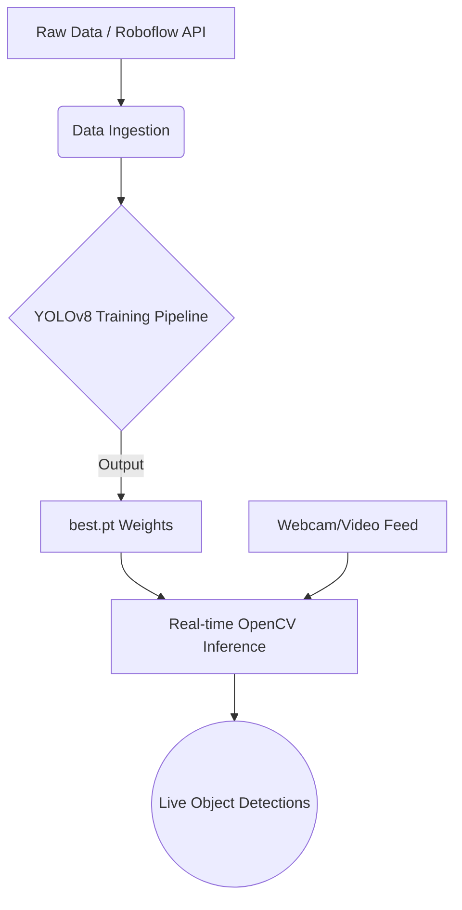

<div align="center">
  

  <a href="https://git.io/typing-svg">
    
  </a>
</div>

<br>

<div align="center">
  
  
  
  
  
</div>

---

## 🌌 Introduction

The **ML Object Detection System** is an advanced computer vision project leveraging the cutting-edge **YOLOv8** (You Only Look Once) architecture for real-time, high-accuracy object detection. Integrated with OpenCV, this model performs rapid inference on live video feeds, correctly identifying and localizing multiple object classes simultaneously.

Trained on the **COCO-128** baseline dataset, the system demonstrates robust performance and real-world applicability in dynamic environments.

---

## ✨ Key Features

| Feature | Description |
| :--- | :--- |
| ⚡ **Real-Time Inference** | Connects to a standard webcam for instant, sub-millisecond object detection overlay. |
| 🧠 **State-of-the-Art CNN** | Utilizes the YOLOv8 Nano (`yolov8n.pt`) deep learning model for optimal speed-to-accuracy balance. |
| 📊 **Custom Training Pipeline** | Includes `train.py` for fine-tuning the model over custom epochs (default 10 epochs on `imagesz=640`). |
| 🔄 **Automated Data Retrieval** | Integrated `Roboflow` API pipeline (`download_data.py`) to easily pull massive datasets (e.g., COCO-2017). |

---

## 🛠️ Project Architecture



---

## 🚀 Getting Started

### 1. Clone the Repository
```bash
git clone https://github.com/YashwanthNavari/ml-object-detection-system.git
cd ml-object-detection-system
```

### 2. Install Dependencies
Ensure you have Python 3.8+ installed. Install the required libraries:
```bash
pip install ultralytics opencv-python roboflow
```

### 3. Run Real-Time Detection
With your webcam connected, launch the primary inference script:
```bash
python detect.py
```
> **Controls**: Press the `q` key inside the detection window to exit the stream securely.

### 4. Custom Model Training
To train the model from scratch on the configured datasets:
```bash
python train.py
```

---

## 💻 Tech Stack

<details>
<summary>Click to view robust technologies utilized</summary>

- **Language:** Python
- **Core Framework:** Ultralytics (YOLOv8)
- **Computer Vision:** OpenCV (`cv2`)
- **Dataset Management:** Roboflow API
- **Model Representation:** PyTorch (`.pt` weights)

</details>

---

<div align="center">
  
</div>
